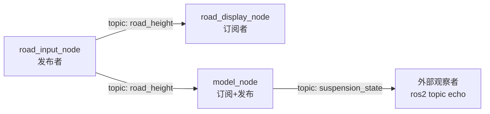

# 编译与运行指南

本指南面向 ROS 2 + C++ 初学者，一步步带你编译并运行本包的节点，观察**发布-订阅**话题通信。

## 0. 目录结构速览

```
suspension_sim/
├── include/suspension_sim/
│   ├── road_profile.hpp       # 路面模型抽象基类 + 多种实现（策略模式）
│   └── quarter_car_model.hpp  # 二自由度四分之一车模型类（欧拉积分）
├── msg/
│   └── SuspensionState.msg    # 自定义消息：悬架系统状态
└── src/
    ├── road_input_node.cpp    # 发布节点：100 Hz 发布 road_height
    ├── road_display_node.cpp  # 订阅节点：订阅并打印 road_height
    └── model_node.cpp         # 模型节点：订阅路面→更新模型→发布 suspension_state
```

三个节点通过话题通信：



## 1. 编译

在**工作空间根目录**（`~/suspension_ws`）下执行：

```bash
cd ~/suspension_ws

# ① 加载 ROS 2 环境（每个新终端都要执行一次）
source /opt/ros/jazzy/setup.bash

# ② 编译本包
colcon build --packages-select suspension_sim
```

> ⚠️ **以后每次新开终端**，都要先 `source /opt/ros/jazzy/setup.bash`，否则 `ros2` 命令不存在。

## 2. 加载 install 环境

编译完成后，在新终端（或当前终端）加载安装环境，让系统能找到你的包：

```bash
source ~/suspension_ws/install/setup.bash
```

> 这个 `source` 也**每次新终端都要执行**，否则 `ros2 run` 会提示找不到包。

## 3. 观察话题通信（核心实验）

### 3.1 终端 A：启动发布节点

```bash
ros2 run suspension_sim road_input_node
```

应看到日志：
```
[INFO] [road_input_node]: road_input_node started: publishing 'road_height' at 100 Hz, profile='sine'
```

### 3.2 终端 B：启动订阅节点

**再开一个新终端**，同样先加载两个环境，然后：

```bash
source /opt/ros/jazzy/setup.bash
source ~/suspension_ws/install/setup.bash

ros2 run suspension_sim road_display_node
```

应看到持续打印（约 100 条/秒，值随正弦波变化）：
```
[INFO] [road_display_node]: road_height = 0.0500 m
[INFO] [road_display_node]: road_height = 0.0499 m
[INFO] [road_display_node]: road_height = 0.0498 m
...
```

### 3.3 运行模型节点（订阅路面 → 发布悬架状态）

**终端 B**（或新开终端），同样加载环境后运行：

```bash
ros2 run suspension_sim model_node
```

应看到日志：
```
[INFO] [model_node]: model_node started: subscribing 'road_height', publishing 'suspension_state' at 100.0 Hz
```

在 **终端 C** 观察模型输出（`--once` 表示只取一条消息）：

```bash
ros2 topic echo suspension_state --once
```

应看到类似输出（随正弦路面动态变化）：

```
time: 3.14
road_height: 0.0123
xs: 0.0098
xus: 0.0121
xs_dot: 0.0045
xus_dot: 0.0110
body_accel: 0.0352
```

字段说明：`xs`/`xus` 为簧上/簧下质量位移，`xs_dot`/`xus_dot` 为速度，`body_accel` 为车身加速度（详见 `msg/SuspensionState.msg`）。

### 3.4 可选：用命令行工具观察（终端 C）

再开一个终端，加载环境后：

```bash
# 查看当前所有话题
ros2 topic list

# 实时打印话题数据（和 road_display_node 的效果一样）
ros2 topic echo road_height

# 查看发布频率（应约 100 Hz）
ros2 topic hz road_height

# 查看话题详情（类型、发布者/订阅者数量）
ros2 topic info road_height

# 查看自定义消息接口定义（模型状态消息）
ros2 interface show suspension_sim/msg/SuspensionState
```

## 4. 切换路面（体验参数）

在终端 C 执行，观察终端 B 的打印值变化：

```bash
ros2 param set /road_input_node road_profile square    # 方波：值在 ±0.05 跳变
ros2 param set /road_input_node road_profile random    # 随机跳变
ros2 param set /road_input_node road_profile sine      # 回到正弦
```

## 5. 停止节点

在对应终端按 `Ctrl+C`。若节点卡住，可强制结束：

```bash
pkill -9 -f road_input_node
pkill -9 -f road_display_node
```

## 6. 常见问题

| 现象 | 原因 | 解决 |
| ---- | ---- | ---- |
| `ros2: command not found` | 未加载 ROS 环境 | `source /opt/ros/jazzy/setup.bash` |
| `Package 'suspension_sim' not found` | 未加载 install 环境 | `source ~/suspension_ws/install/setup.bash` |
| `road_display_node` / `model_node` 没有任何输出 | 发布节点没启动，或话题名不一致 | 先启动 `road_input_node`；确认订阅/发布话题名一致 |
| `Eigen/Dense: No such file`（编译错误） | 未链接 Eigen 头文件 | CMake 中 `target_link_libraries(model_node Eigen3::Eigen)` |
| `ament_target_dependencies() ... 'suspension_sim' was not found` | 消息目标是 `rosidl` 生成目标，不是 `find_package` 的包 | 改用 `rosidl_get_typesupport_target()` 获取目标再 `target_link_libraries` |
| `param set` 连到旧节点 | 有残留进程占用节点名 | `pkill -9 -f road_input_node` 后重试 |

## 7. 小练习（检验理解）

1. 把 `road_input_node` 的发布频率从 100 Hz 改成 20 Hz（改 `road_input_node.cpp` 里定时器周期为 50ms），重新编译，看 `ros2 topic hz` 和 `road_display_node` 打印频率是否变为 20 Hz。
2. 想想看：如果 `road_display_node` 先启动、`road_input_node` 后启动，`road_display_node` 会不会漏掉消息？订阅 QoS（`create_subscription` 的第 3 个参数）里的队列深度 `10` 是干什么的？
3. 打开 `model_node.cpp`，把 `ks`（悬架刚度）参数改大（如 `15000 → 30000`），重新编译运行，观察 `body_accel` 和位移幅值如何变化。想想为什么刚度变大后振动传递变多？
4. 在 `msg/SuspensionState.msg` 中增加一个字段（如 `suspension_travel` = xs - xus，悬架动行程），在 `model_node.cpp` 中赋值，重新编译后 `ros2 interface show` 验证新字段。
